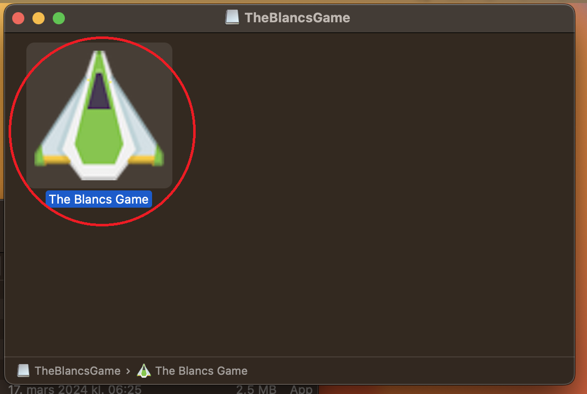
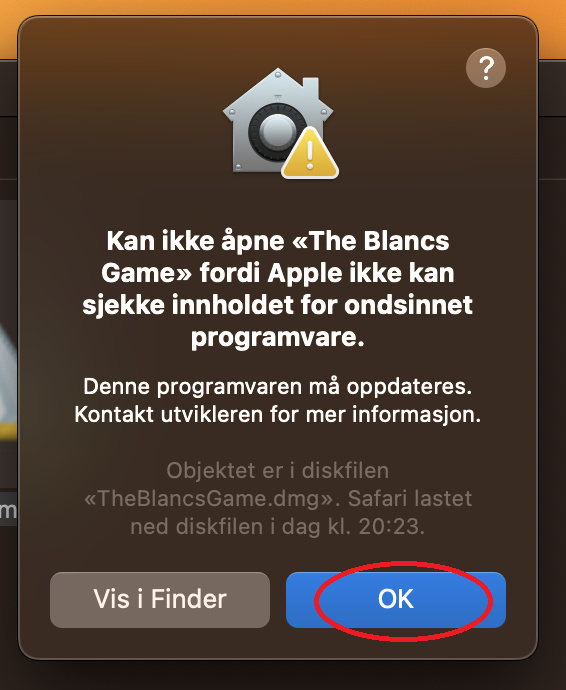
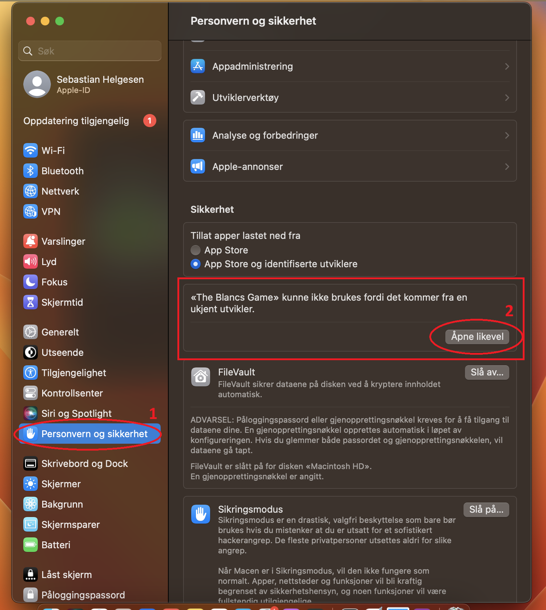
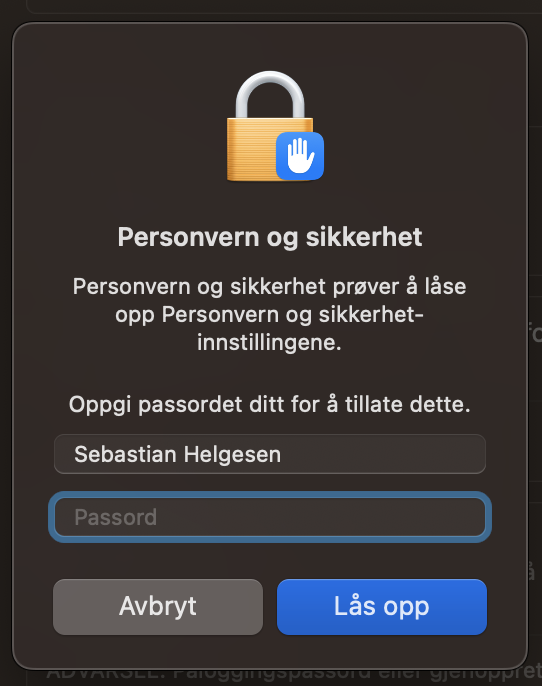
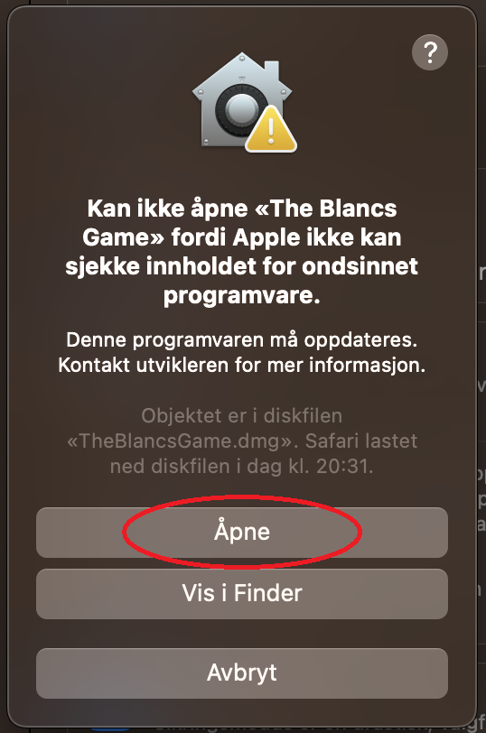
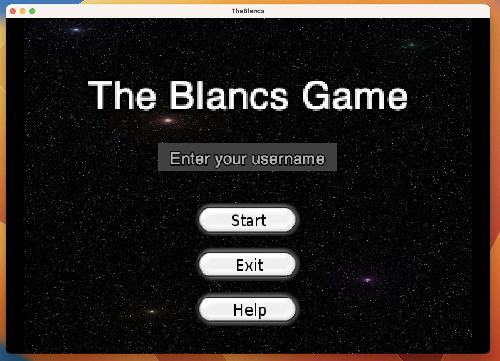
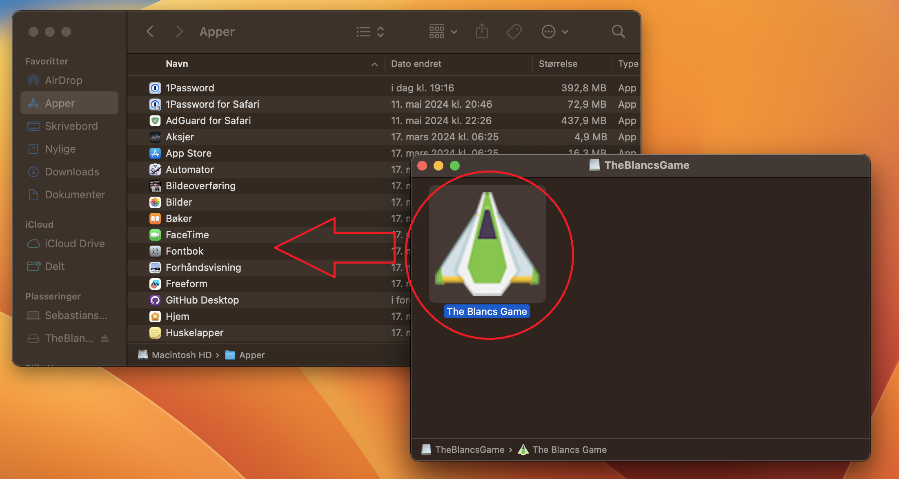
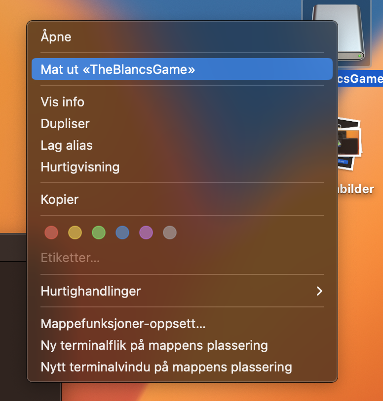

# Last ned The Blancs Game på MacOS

> Dette er for øyeblikket testet kun på en Intel bassert Mac. Det kan dermed være at det ikke fungerer på macer som benytter Apple Silicon.

> Programmet krever Java Runtime Environment (JRE) for å kjøre. Hvis du ikke har JRE installert kan du laste ned det fra [java.com](https://www.java.com/).

1. Last ned TheBlancsGame.dmg [ved å klikke på denne linken.](https://github.com/helges1/The-Blancs/raw/main/TheBlancsGame.dmg)

2. Når filen er lastet ned i nettleseren, klikk på den for å åpne programmet.

3. Når du åpner programmet vil du få opp dette vinduet. Dobbeltklikk på "The Blancs Game" ikonet for å starte spillet.

4. Når du har dobbeltklikket på "The Blancs Game" ikonet vil du få opp en advarsel. Klikk på "OK".

5. Gå til systeminnstillinger -> Personvern og sikkerhet og scroll ned til du finner valget som vises under. Klikk på "Åpne likevel".

6. Skriv inn passordet til Macen din, og klikk "Lås opp".

7. Klikk på "Åpne" for å starte spillet.

8. Nå er spillet klart til å spilles.

## Valgfritt: Legg til spillet i applikasjonsmappen

Ved å dra spillet til applikasjonsmappen vil du enkelt kunne starte spillet fra Launchpad når du ønsker å spille.

9. Dra spillet til applikasjonsmappen.

10. Når du åpner spillet fra "Apper" mappen kan det være at du må følge steg 4-7 igjen. Dette er fordi MacOS er designet for å være sikker, og dermed krever at du godkjenner at du ønsker å åpne programmer som ikke er fra App Store, eller en godkjent utvikler.

11. Nå er spillet klart til å spilles fra Launchpad, og du kan trygt mate ut installasjonsfilen.

