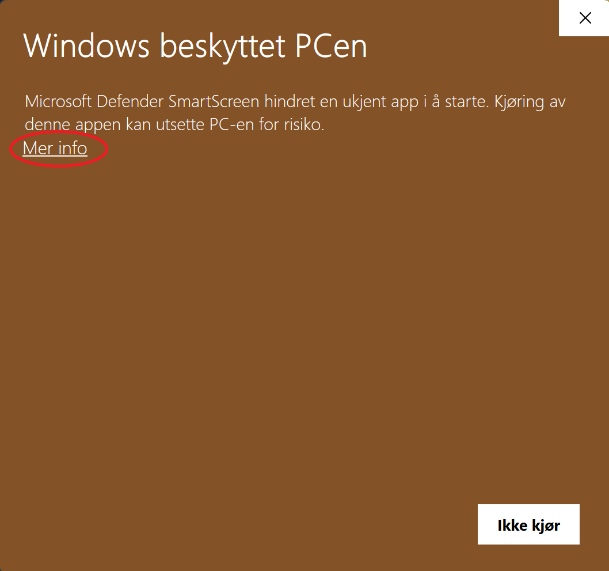
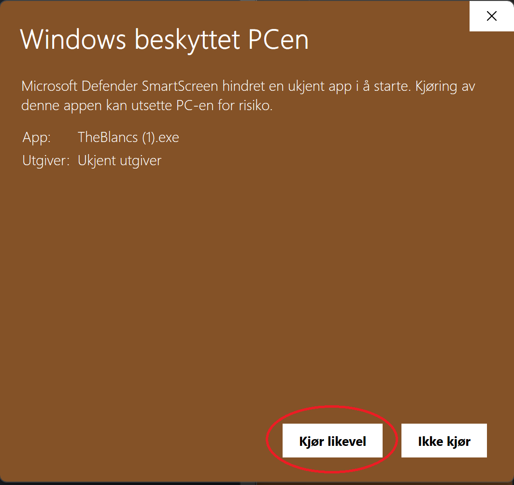
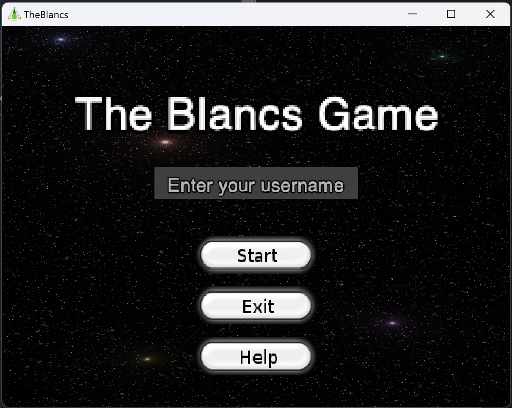

# Last ned The Blancs Game på Windows

1. Last ned TheBlancs.exe [ved å klikke på denne linken.](https://github.com/helges1/The-Blancs/raw/main/TheBlancs.exe)
2. Når filen er lastet ned i nettleseren, klikk på den for å åpne programmet.
3. Når du åpner programmet vil du mest sannsynlig få en advarsel fra Microsoft Defender. Klikk på "Mer info".
   
4. Når du har klikket på "Mer info" vil du få muligheten til å klikke på "Kjør likevel".
   
5. Når du har klikket på "Kjør likevel" vil spillet åpne seg, og du kan begynne å spille.
   
